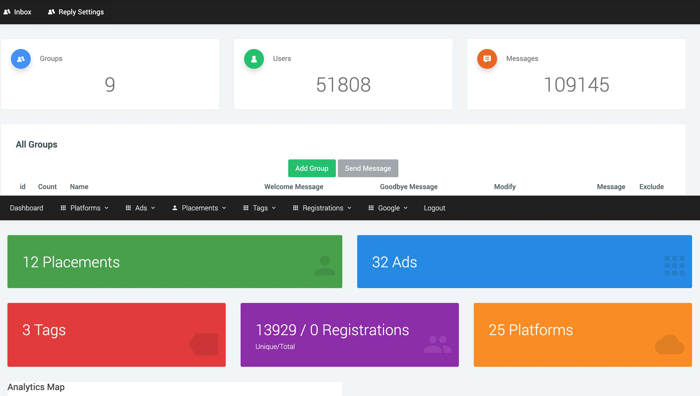
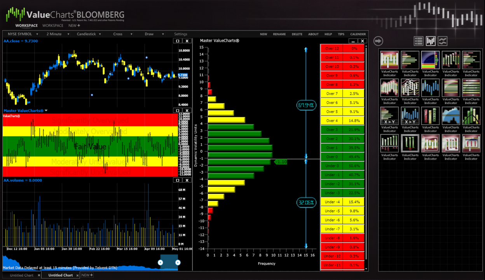
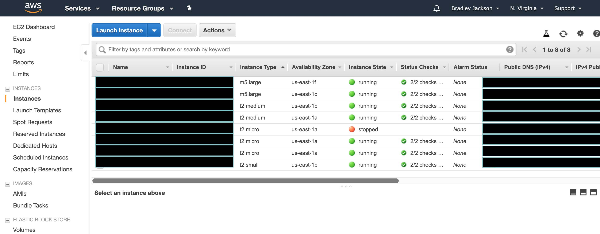
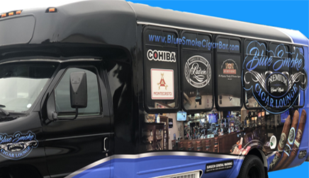

---
# Feel free to add content and custom Front Matter to this file.
# To modify the layout, see https://jekyllrb.com/docs/themes/#overriding-theme-defaults

layout: default
tagline: Modern Software Solutions & Digital Marketing
line1: Brad
line2: Jackson
line3: SCROLL DOWN
---
<section class="intro">
  

    

      

        <h6>ABOUT ME</h6>
        <h2 data-text="Digital">Experienced software architect in a variety of markets</h2>
      

      <!-- end col-12 -->
      

        <h4>Any fool can write code that a computer can understand. Good programmers write code that humans can understand - Martin Fowler</h4>
      

      <!-- end col-5 -->
      

        
From mobile game &amp; app development, to healthcare, to trading &amp; investing software, I've worked on a huge variety of projects. Here's just a handselected list of my accomplishmenets:

        

          <ul>
            <li>Lead Developer on many mobile games, including Uno which had over 1 million downloads</li>
            <li>Sole Developer on ValueCharts Bloomberg, a trading application built for the Bloomberg trading terminals. Voted best looking and most user friendly app</li>
            <li>Head of Software for a healthcare agency whose clientele included billion dollar pharmaceutical companies</li>
            <li>Director of Development for a creative agency whose clientele include top Fortune companies like General Electric &amp; IBM</li>
            <li>Software Development Manager for a D&amp;D Contractor developing applications for the Air Force &amp; Navy</li>
            <li>Director of Development for an online trading &amp; investing company who delivers online financial summits and pushes the boundaries with properietary tools such as a custom ad network, SMS messaging app, and a cloud based infrastructure.</li>
          </ul>
        

        
 <a href="#services-content-block">
          
   

          <!-- end lines --> 
          <b>SCROLL SOME MORE TO LEARN ABOUT MY PROCESS</b></a> 

        <!-- end custom-link --> 
      

      <!-- end col-7 --> 
    

    <!-- end row --> 
  

  <!-- end container --> 
</section>
<!-- end intro -->
<section class="services-content-block">
  

    <video src="videos/video.mp4" muted loop autoplay></video>
  

  <!-- end video-bg -->
  

    

      

        <h6>THE 3 PHASES OF MY PROCESS</h6>
        <h2>Creation of modern, user friendly applications &amp; websites </h2>
      

      <!-- end col-12 -->
      

        

          
<small>PHASE 01</small>

          <!-- end left -->
          

            <h4>THINK IT OUT</h4>
            
Conceptualize &amp; Plan to minimize problems later

            <ul>
              <li>Application &amp; Website</li>
              <li>UX/UI</li>
              <li>Content</li>
              <li>Launch Plan</li>
              <li>Marketing</li>
              <li>Infrastructure &amp; Scaling</li>
            </ul>
          

          <!-- end right --> 
        

        <!-- end content-box --> 
      

      <!-- end col-4 -->
      

        

          
<small>PHASE 02</small>

          <!-- end left -->
          

            <h4>BUILD IT OUT</h4>
            
Begin developing the solution that fits your needs

            <ul>
              <li>Prototype</li>
              <li>Software Development</li>
              <li>Content Creation</li>
              <li>Testing &amp; Deployment</li>
              <li>Cloud infrastructure</li>
            </ul>
          

          <!-- end right --> 
        

        <!-- end content-box --> 
      

      <!-- end col-4 -->
      

        

          
<small>PHASE 03</small>

          <!-- end left -->
          

            <h4>GET THE WORD OUT</h4>
            
If you build it they still might not come. Let's fix that

            <ul>
              <li>CRM</li>
              <li>Email Lists</li>
              <li>Ad Purchasing</li>
              <li>SMS Messaging</li>
              <li>Social Media</li>
            </ul>
          

          <!-- end right --> 
        

        <!-- end content-box --> 
      

      <!-- end col-4 --> 
    

    <!-- end row --> 
  

  <!-- end container --> 
</section>
<!-- end services-content-block -->
<section class="works">
  

    

      

        <h6>CATCH A GLIMPSE</h6>
        <h2 data-text="Works">A showcase of our selected works</h2>
      

      <!-- end col-12 -->
      

        

          <figure> </figure>
          

            
 <small>APPLICATIONS FOR BUILDING CUSTOMER LISTS &AMP; MANAGING COMMUNICATIONS</small>
              <h3>MarketingTools</h3>
              
 <a href="/marketing-tools">
                
   

                <!-- end lines --> 
                <b>LEARN MORE</b></a> 

              <!-- end custom-link --> 
            

            <!-- end inner --> 
          

          <!-- end content-box --> 
        

        <!-- end project-box -->
        

          <figure> </figure>
          

            
 <small>AMAZING USER INTERFACE &amp; AND SIMPLE TO USE</small>
              <h3>ValueChartsBloomberg</h3>
              
 <a href="/valuecharts-bloomberg">
                
   

                <!-- end lines --> 
                <b>LEARN MORE</b></a> 

              <!-- end custom-link --> 
            

            <!-- end inner --> 
          

          <!-- end content-box --> 
        

        <!-- end project-box -->
        

          <figure> </figure>
          

            
 <small>MULTIPLAYER MOBILE APP FEATURING 1MILLION+ DOWNLOADS</small>
              <h3>MATTEL'SUNO</h3>
              
 <a href="/uno">
                
   

                <!-- end lines --> 
                <b>LEARN MORE</b></a> 

              <!-- end custom-link --> 
            

            <!-- end inner --> 
          

          <!-- end content-box --> 
        

        <!-- end project-box --> 
        

          <figure> </figure>
          

            
 <small>CLOUD BASED INFRASTRUCTURE WITH AMAZON AWS</small>
              <h3>CloudInfrastrucure</h3>
              
 <a href="/cloud-infrastructure">
                
   

                <!-- end lines --> 
                <b>LEARN MORE</b></a> 

              <!-- end custom-link --> 
            

            <!-- end inner -->  
          

          <!-- end content-box --> 
        

        <!-- end project-box -->
      

      <!-- end col-12 --> 
    

    <!-- end row --> 
  

  <!-- end container --> 
</section>
<!-- end works -->
<section class="process">
  

    

      

        <h6>HERE'S WHAT I KNOW</h6>
        <h2 data-text="Skills">Technology</h2>
        <h4>Anyone who says they're a master at something is a liar. There's always more to learn.</h4>
      

      

        

        

        

        

        

      

      <!-- end col-12 -->
    

    <!-- end row --> 
  

  <!-- end container --> 
</section>
<section class="work-with-us">
  

    

      

        <h6>START WORKING WITH ME</h6>
        <h2 data-text="Hire Me">That's just a small showcase of my work.  I'd love to opportunity to talk with you more about some of the other things I've done.
          Please contact me at <a href="mailto:hello@bradjackson.dev?Let's Work Together">hello@bradjackson.dev</a> to get started on your next project!</h2>
      

      <!-- end col-12 -->
      

        <h4>Do you have a project, opportunity, or are you just a looking to discuss possible solutions? <a href="mailto:hello@bradjackson.dev?Let's Work Together">Contact me now!</a> </h4>
        
 <a href="#clients">
          
   

          <!-- end lines --> 
          <b>Psstttt... There's still more below</b></a> 

        <!-- end custom-link --> 
      

      <!-- end col-5 --> 
    

    <!-- end row --> 
  

  <!-- end container --> 
</section>
<!-- end work-with-us -->
<section class="clients">
  

    

      

        <h6>THIS IS THE MORE PART</h6>
        <h2>My Clients</h2>
        <h4>Here's a sampling of some of the work around the web we've done. Enjoy!</h4>
        
 <a href="mailto:hello@bradjackson.dev?subject=Let's Work Together">
          
   

          <!-- end lines --> 
          <b>CLICK HERE TO GET ADDED TO THE LIST</b></a> 

        <!-- end custom-link --> 
      

      <!-- end col-4 -->
      

        <ul>
          <li><a href="https://www.bluesmokecigarbar.com" target="_blank"><small>Blue Smoke Cigar</small></a></li>
          <li><a href="https://www.bluecigarbus.com" target="_blank"><small>Blue Cigar Bus</small></a></li>
        </ul>
      

      <!-- end col-7 --> 
    

    <!-- end row --> 
  

  <!-- end container --> 
</section>
<!-- end clients -->